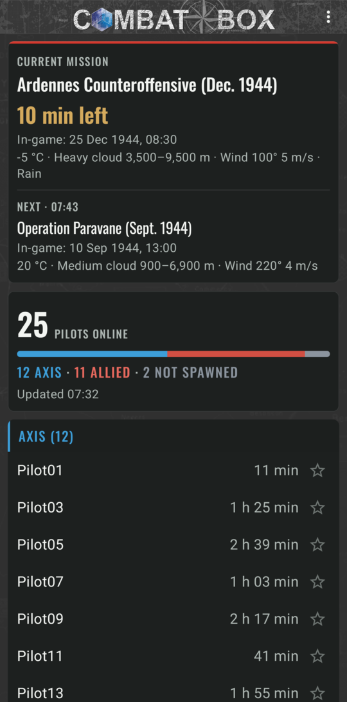
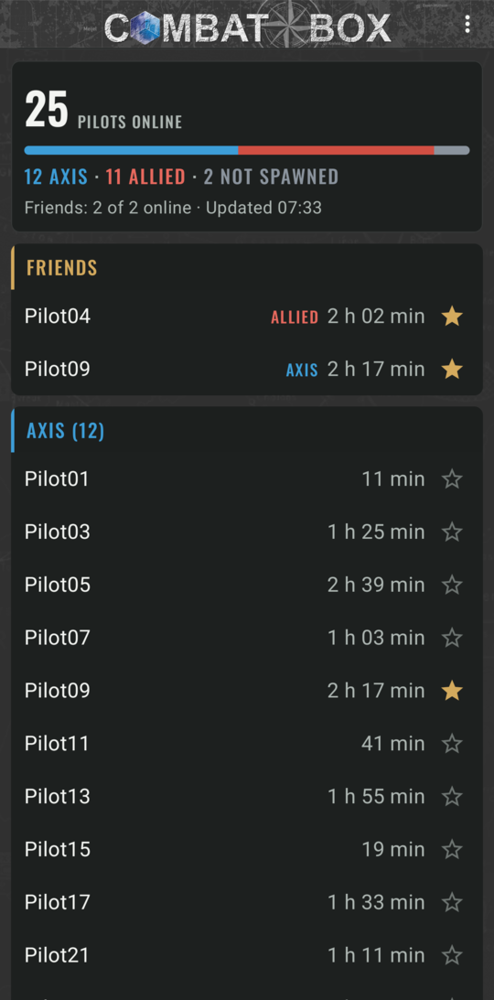
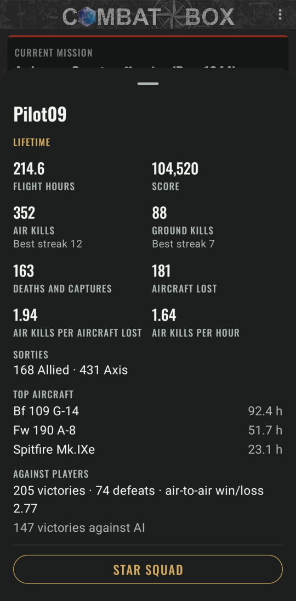

# CB Online

See who's flying on [Combat Box](https://combatbox.net) (IL-2 Great Battles) before you start the sim. CB Online shows who's online, the current mission and how long it has left, and your friends at the top of the list.

**Website:** [riaanjutte.github.io/CBOnline-Android](https://riaanjutte.github.io/CBOnline-Android/)

**[Download the latest version](https://github.com/riaanjutte/CBOnline-Android/releases/latest)** · Android 8.0 or newer · free

  
  
  

The pilot names in these screenshots are made up.

## What it shows

- **Who's online.** The pilot count, the Axis / Allied split, and both side lists with how long each pilot has been in the mission.
- **The current mission.** You get its name, a countdown to the end, the in-game date and time, and the weather.
- **What's next.** The next mission shows when it starts (in your phone's time), with its own date and weather.
- **Your friends.** Tap the star next to a name, and that pilot is pinned in a Friends section at the top. When they aren't flying, they're shown there as offline.
- **Pilot stats.** Tap any pilot to see their lifetime record: flight hours, kills and best streaks, their most-flown aircraft, and how they do against other players.
- **Squads.** In a pilot's stats, star their squad tag (like =JG52=), and everyone online with that tag shows under Friends too.
- **Fresh data.** The app refreshes every minute while it's open. Pull down to refresh straight away.
- **Update notices.** The app tells you when a new version is out.

## Installing

CB Online isn't on the Play Store. You install it from this page.

1. On your phone, open the [latest release](https://github.com/riaanjutte/CBOnline-Android/releases/latest).
2. Under **Assets**, tap **CBOnline-&lt;version&gt;.apk** to download it.
3. Open the downloaded file from the notification or your Downloads folder.
4. If Android says your browser isn't allowed to install apps, tap **Settings**, turn on **Allow from this source**, then go back.
5. Tap **Install**.

**Google Play Protect may show a warning** because the app doesn't come from the Play Store. It might say the app is from an unknown developer, or offer to scan it. The wording varies between phones. Tap **More details** and then **Install anyway**. If it offers a scan, either choice is fine.

Only download CB Online from this repository's releases page.

### If Android says the developer is unverified

Google is phasing in [developer verification](https://developer.android.com/developer-verification/guides/faq) on Android. Phones with Google Play can refuse to install apps from developers who haven't registered with Google. It's starting in Brazil, Indonesia, Singapore and Thailand, and is due to reach other countries in 2027. Updates are affected too.

If your phone won't install CB Online because it's from an unverified developer, you can allow such apps. You only need to do this once:

1. [Turn on Developer options](https://www.android.com/articles/enable-android-developer-settings/).
2. In Developer options, turn on the setting for apps from unverified developers. Confirm that nobody is pressuring you to do it, then restart your phone.
3. Wait 24 hours. This is a one-time safety delay.
4. Go back to the same setting and confirm with your fingerprint, face or PIN. You can then allow these apps for 7 days or indefinitely.
5. Open the APK again and tap **Install anyway**.

If you use adb on a computer, `adb install CBOnline-<version>.apk` also works, with no waiting.

## Updating

When a new version is published, a notice appears at the top of the app: *Version x.y.z available*.

- Tap **Download** to open the release page, then install the new APK the same way as before. It installs over the old version, and your starred friends are kept.
- Tap **Dismiss** to hide the notice for that version.

## Questions

**Does it run in the background or drain my battery?**
No. It only refreshes while it's on screen and stops when you leave it. It never sends notifications.

**Do I need an account?**
No. There's nothing to sign in to, and the only access the app needs is to the internet.

**What does it send or collect?**
Nothing about you. It reads Combat Box's public player and mission data and asks GitHub whether there's a newer version. Your starred friends and squads are stored only on your phone.

**A red bar says "Couldn't refresh".**
The latest refresh failed, so you're seeing the last list that loaded, and the bar gives its time. The app keeps trying every minute, and you can pull down to try again now.

**The mission card is missing.**
The mission card appears once the mission information has loaded. If that information can't be reached, you'll still see who's online without it.

**My friend is flying but shows as offline.**
Stars follow the in-game name, ignoring capitals. If your friend changed their name, star the new one. To remove the old name, tap its star in the Friends section.

**I found a bug or have an idea.**
Please [open an issue](https://github.com/riaanjutte/CBOnline-Android/issues).

## Credits

- The Combat Box logo, wordmark and map artwork are used with permission.
- The app uses the [Oswald](https://fonts.google.com/specimen/Oswald) typeface, under the [SIL Open Font License 1.1](app/src/main/assets/licenses/OFL-Oswald.txt).

## For developers

To build, test and release the app, see [DEVELOPMENT.md](DEVELOPMENT.md).
